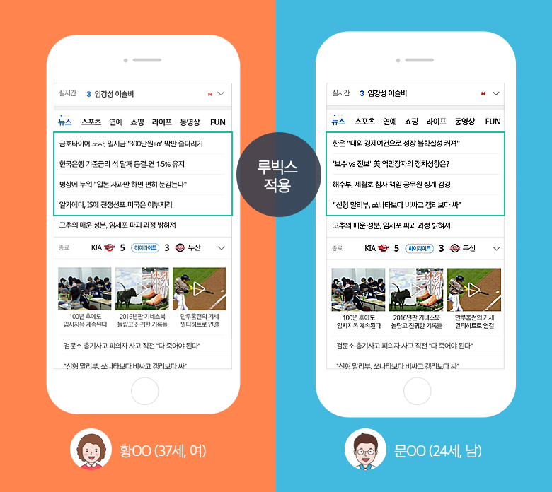

# 카카오 추천 엔진, 루빅스를 까봅시다

김한길

카카오는 2015년 6월, 국내 인터넷 업계 최초로 모바일다음 뉴스 메인화면에 인공지능 추천 엔진을 적용했습니다. 여기에 적용된 추천 엔진이 바로 루빅스(RUBICS)입니다. 

[맞춤형 추천뉴스 루빅스를 소개합니다](https://blog.kakaocorp.co.kr/412)

- 루빅스는 성별&연령별 메인 뉴스의 이용자 반응을 실시간으로 측정하여 해당 그룹별로 클릭률이 높은 뉴스기사를 보여줍니다.
- 만약 이용자 집단을 알 수 없는 사용자라면 전체 이용자 경험을 분석해 가장 많이 본 기사를 우선 배치합니다.

과연 어떤 방법으로 이러한 개인화 추천 서비스를 제공할 수 있을까요? 함께 살펴봅시다! 

(본 글은 '참고자료'에 언급한 카카오에서 작성한 루빅스 관련 논문 및 블로그 글을 토대로 작성하였습니다)

# 기계학습 기반 뉴스 추천 서비스 도입 필요성

- 모바일 기기를 통한 뉴스 소비가 보편화 되면서, **작은 모바일 기기 화면 속 한정된 공간에서 뉴스의 노출과 배열이 효율적으로 이루어지기 위해서는 개개 이용자의 뉴스 소비 패턴에 따라 배치가 달라지는 개인화 서비스** 개발이 필요

    * 다음 모바일 뉴스 화면에는 20개 내외의 뉴스만 노출 가능

- 이미 개인화된 소셜 미디어 서비스에 이용자들이 충분히 익숙해져있는 상태였기에 뉴스에서도 개인화 된 내용을 전달하는 것이 시기적으로도 적절하다는 판단
- 이에 따라 루빅스는 2015년 5월, 한 달간의 시험 적용을 거쳐, 2015년 6월에 다음 모바일 뉴스 메인화면에 전면 도입됨(추후 2017년 4월 PC서비스에도 적용)

# 뉴스 추천시스템에는 어떤 알고리즘을 적용하면 좋을까?

## 기계학습 기반 뉴스 추천 서비스 사례

- 추천시스템에 흔히 사용되는 기계학습 알고리즘에는 Content-Based Filtering(CBF)과 Collaborative Filtering(CF)가 있음. 일반적으로 CF가 우수한 성능을 보이나 Cold start problem 존재
- 실험적 연구 사례 : 미네소타대학 컴퓨터공학과 GroupLens 프로젝트

    (94년) User-user Collaborative Filtering → (90년대 말) hybrid

- 상업적 적용 사례1: 구글

    동시방문자수(Covisitation), 민해쉬(MinHash), PLSI(Probabilistic Latent Semantic indexing) 등의 CF 알고리즘들을 결합한 Ensemble 알고리즘에 CBF 등을 결합

- 상업적 적용 사례2: 야후
    - 1차적으로 야후 에디터가 품질 높은 뉴스 목록을 가려낸 후 다양한 개인화 또는 비개인화 추천 알고리듬을통해 이용자가 가장 좋아할만한 콘텐츠를 노출 영향도가 가장 높은 지역에 배치
    - 오프라인 시뮬레이션과 온라인 버킷 테스트(Bucket Test) 등을 통해 시험, 교체하면서 점진적으로 알고리듬을 개선

        노이즈에 강한 순차모델인 칼먼 필터를 사용한 실시간 인기뉴스 추천 알고리듬(Agarwal et al. 2008), 이용자 클러스터 기반 추천 알고리듬(Chu et al., 2009), 이용자와 뉴스의 특성들 사이의 선호도를 학습하는 Bilinear Regression 알고리듬(Chu & Park, 2009),Regression 기반의 행렬분할 모델(Agarwal & Chen 2009), 콘텍스트 정보를 활용한 콘텍스튜얼 멀티암드밴딧(Contextual Multi-Armed Bandit) 알고리듬(Li etal., 2010) 등의 다양한 알고리즘 사용

## 다음모바일 서비스 이용자 특성

서비스를 주로 이용하는 사람들이 누구이고 어떤 패턴으로 뉴스를 소비하고 있는지에 따라 이에 맞는 적절한 알고리즘을 선택해야 합니다. 다음모바일 서비스 이용자들은 다음과 같은 특성을 보이고 있었습니다.

- 이용자 대다수는 뉴스가 아니라 다음 검색, 메일, 카페 등 다른 다음서비스를 사용하기 위해 다음 앱/웹페이지를 방문하고 있었다. 즉 뉴스서비스에 대한 열성적인 이용자(Heavy User)는 드물다..
- 이용자 대부분은 로그인을 하지 않고 서비스를 이용한다.

다시 말해 **우리는 유저들의 행동 정보나 특성 정보를 사전에 알고 있기 어려운 상황**입니다. 즉 대부분이 '콜드 스타트 이용자’이기에 CBF나 CF 기반의 개인화 추천 방식은 적용하기 어렵습니다.

그래서 **유저 정보를 모른 상태에서도 실시간으로 클릭률을 통해 추천목록을 개선해나갈 수 있는 통계적 기계학습 기법인 Multi-Armed Bandit 알고리즘을 이용하기로 결정**합니다.

## Multi-Armed Bandit(MAB) Problem

멀티 암드 밴딧 문제는 카지노에서 슬롯머신 게임을 하는 상황을 가정하고 있습니다. 우리가 지금 미국 라스베이거스에서 도박을 하고 있다고 생각해보죠. 규칙은 다음과 같습니다.

- 여러 대의 슬롯머신이 있고 한 번에 한 머신만 돌릴 수 있다.
- 각 머신별 이길 수 있는 확률은 고정되어 있고 서로 다르다.(당연히 우리는 정확한 확률을 알고 있지 못하다)

왜 Multi-Armed Bandit인가?
슬롯머신은 그 모양때문에 흔히 외팔이 강도(One-Armed Bandit)라고 불립니다. 또한 카지노에서 여러 대의 슬롯머신이 있는 상황을 가정하고 있어 앞에 multi가 붙었습니다.

### 어떤 전략을 짜야 돈을 많이 딸 수 있을까요?

우선은 각 슬롯 머신의 승률이 어떠한지를 테스트해봐야 할 겁니다(탐색: Exploration). 그 후에 승률이 높은 머신을 위주로 돌리면 되겠죠(수확: Exploitation). 그런데 테스트를 몇 번이나 해야 할까요? 10번? 100번? 1,000번 테스트 하고 나면 그 순간에 가장 승률이 높은 머신이 정말로 승률이 가장 높은 머신이라고 확신할 수 있을까요? 

이러한 고민 결과, 아래와 같이 MAB 문제를 푸는 다양한 알고리즘이 나왔습니다.

(루빅스 추천시스템을 이해하는데 아래 알고리즘을 자세히 이해할 필요는 없습니다. 혹 자세한 사항이 궁금하다면  [https://soobarkbar.tistory.com/135](https://soobarkbar.tistory.com/135) 를 참고하세요)

1. greedy : 일정 횟수 탐색 후 그 시점에서 기대보상이 가장 높은 머신으로만 수확
2. ε (epsilon) - Greedy : 기본적으로는 1-ε의 확률로 기대보상이 가장 높은 머신을 돌리되, ε 확률로 나머지 머신 중에서도 무작위로 하나를 골라 탐색
3. The Softmax Algorithm: 무작위가 아니라 기존 승률을 고려하여 선택될 확률을 부여
4. UCB : 기존 승률+승률의 불확실성(낮을수록)을 고려하여 선택될 확률을 부여
5. Thompson sampling

# MAB 알고리즘을 적용해봅시다

뉴스 추천 문제는 다시 말해 "어떤 뉴스를 보여줘야 높은 클릭률을 획득할 수 있을까?"란 문제입니다. 이를 MAB문제로 치환한다면 아래와 같이 생각할 수 있습니다. 

- 특정 슬롯 머신을 돌리는 행위 = 특정 뉴스를 골라 게재하는 행위
(머신을 돌리는 것은 뉴스를 골라 게재하는 행위이지 클릭하는 행위가 아닙니다)
- 슬롯 머신 승률 = 뉴스가 클릭 될 확률(Click Through Rate, CTR)
- 기대보상 = 총 뉴스 클릭수

오~ MAB 문제와 모바일 뉴스 추천 문제가 비슷하네요. 그럼 MAB 알고리즘 중 하나를 적용해보면 될까요?

## 아니요ㅜ 슬프게도 모바일 뉴스와 MAB 문제는 상황이 다릅니다

다시 생각해보니 모바일 뉴스 추천에서 CTR은 MAB 문제에서 슬롯머신 승률과는 꽤나 상이한 특성을 가지고 있습니다. MAB에서는 슬롯머신 승률이 고정적이었던 것에 반해 모바일 뉴스 상황에서 뉴스별 CTR은 시간과 노출 위치에 따라서 변합니다. 또한 MAB에서는 동일한 슬롯머신이 매번 모두 선택 가능한 상태이나, 뉴스에서는 수많은 뉴스 중 특정 뉴스만 노출되고 사라지기를 반복합니다.

승률, 즉 CTR을 추론할 수 있어야 CTR이 높은 뉴스를 우선적으로 추천해줄텐데 모바일 뉴스에서 이렇게 CTR이 수시로 변한다면 우리는 어떻게 CTR을 측정해야 할까요? 하나하나 살펴봅시다.

### 뉴스 CTR 특성 첫번째 : 시간에 따라 변한다.

- (MAB) 승률 변동 없음 / (뉴스) 시간이 경과 할수록 클릭률이 떨어지는 경향 존재

    

- (MAB) 머신의 개수와 종류는 변하지 않음 / (뉴스) 추천 목록이 끊임없이 바뀜
* 다음 모바일 뉴스 화면에는 20개 내외의 뉴스만 노출 가능

    새로 노출된 뉴스에 대해서는 다시 충분한 수준의 탐색이 이루어져야 하기에 우리가 MAB에서 사용했던 전체 탐색 횟수에 반비례해서 탐색 비율을 줄이는 담금질(annealing) 전략은 효율이 떨어집니다.

따라서 

1. CTR은 지속적으로 반복해서 측정되어야 합니다. 보다 정확히 측정하려면 당연히 측정 단위시간이 짧으면 짧을수록 좋겠죠

    **→ 매 분 단위로 각 뉴스 CTR을 측정합시다.** 

2. 하지만 단위시간이 짧다면 그 사이 충분한 데이터가 모이지 않아 오히려 CTR 값이 부정확할 수 있습니다. 

    **→ 이동 평균(Moving Average) 알고리듬 방식으로 과거 CTR값을 반영하여 현재 CTR값을 측정합시다.**

    이동 평균 알고리듬 방식 CTR은 과거 CTR값을 현재 CTR계산에 반영하되, 최신 CTR 값일 수록 높은 가중치를 주는 방식입니다. 아래 수식과 같이 노출(Impression) 수와 클릭 수 모두 뉴스 i의 n-1분과 n분 사이 값에 뉴스 i의 n분까지의 노출 수의 가중합(Weighted summation)을 더한 값으로 구한다.(가중치 d<1)

    이를 통해 클릭어뷰징에 따라 편차가 클 수 있는 CTR의 특성을 보완할 수 있습니다.

### 뉴스 CTR 특성 두 번째: 뉴스 위치에 따라 변한다(Positional Bias)

뉴스 CTR은 아래 표에서 보듯이 화면의 어느 위치에 뉴스가 노출되는지에 따라 동일한 뉴스라도 상당히 다른 CTR을 얻게됩니다.

우선 생각해볼 수 있는 대안은 뉴스 위치에 따라 가중치를 부여하는 방식입니다. 즉 최상단에 배치된 뉴스들이 가장 아래 배치된 뉴스보다 클릭률이 평균적으로 얼마나 증가하는지를 측정하여 결과값을 이 수치로 보정해주는 것입니다. 하지만 CTR이라는 수치는 위치 외에도 뉴스의 품질, 함께 제공되는 다른 뉴스들의 CTR 등 수많은 외부요인에 영향을 받기에 정확한 positional bias 크기를 측정하기 어려웠고 당연히 유의미한 성과로 이어지지 못했습니다.

**→ 이중의 탐색 도입: 모든 위치에 한 번씩 다 노출시키고 이를 평균으로 계산합시다.** 

특정 뉴스를 모든 위치에서 ‘1/N ×총 탐색 수’만큼 동일하게 검증하고 이를 평균하여 해당 뉴스 CTR을 도출한다면  위치 편향을 배제한 값을 도출해낼 수 있습니다.

이렇게 도출한 CTR을 기준으로 개별 뉴스 '승률'을 측정하는 알고리즘을 Customized MAB 라고 부릅시다.

## 이렇게 만들어진 추천 모델은 다음과 같습니다!

우리가 만든 개인화 추천시스템은 기본적으로 다음과 같습니다.

1. 사용자가 접속하면 성별/연령대에 따른 집단 중 하나로 분류합니다.
특별히 스포츠 영역에서는 클러스터링 방식을 적용하여 국내 프로야구, 미국 메이저리그, 축구 등 3가지 집단으로 분류합니다.
2. 해당 사용자 접속 이전에 동일 집단에게 제공되는 추천 뉴스 목록을 보여줍니다.
3. 해당 사용자가 특정 뉴스를 클릭하면 추천시스템은 실시간으로 이를 (Customized MAB 알고리듬 방식으로)학습하고, 이를 바탕으로 해당 집단 추천 목록을 새롭게 도출합니다.
4. 2~3번을 반복하며 계속해서 추천목록을 업데이트 해나갑니다. 

- 만약 이용자 집단을 알 수 없는 사용자의 경우에는, 전체 이용자 선호도를 이용합니다.
- 추가적으로 뉴스 다양성을 높이기 위한 다음의 룰을 적용합니다.
    - 해다 유저가 한 번 읽은 뉴스는 추천 목록에서 제외합니다.
    - 특정 뉴스가 반복되어 추천됐음에도 이용자가 클릭하지 않을 시, 뉴스 서비스를 빈번하게 사용하는 이용자에 한해 이를 부정적인 ‘피드백(Feedback)’ 으로 간주하고 ‘패널티(Panelty)’를 부여하여 제외되도록 처리합니다.
    - 동시에 너무 빈번하게 뉴스가 변경될 때 오는 이용자 혼란을 방지하기 위해 일정 시간동안은 추천 뉴스 배치를 바꾸지 않도록 합니다.
- 위 절차와는 별개로 신규 뉴스가 등록되면 1)클러스터 분석 후 2)문서 간 중복/어뷰징 필터링을 적용한 뒤 3) 서비스원칙에 반하는 뉴스를 제외한 나머지를 뉴스풀에 등록해두는 작업이 별도로 이루어집니다.

1번에서의 집단 구분은 어떻게 하는걸까요? 
로그인을 한 유저가 아니라면? 모바일 기기에도 로그를 남길 수 있는가?

위에서 보듯이 사실 이 추천시스템의 개인화 단위는 개인이 아닌 집단입니다. 아마도 개인 단위로 개인화를 하기에는 개인이 뉴스를 클릭한 정보가 너무 부족하여 이를 집단으로 묶어 CTR을 도출하는게 아닐까 합니다. 

# 평가 방법 정하기

## 오프라인 시뮬레이션(Offline simulation)

우리가 모델을 만들었다고 해서 무작정 실제 서비스에 적용하기에는 리스크가 너무 큽니다. 그래서 실 서비스에 적용하기 전에 우리가 보유하고 있는 데이터를 가지고 사전 테스트를 해보는게 좋겠죠. 이를 오프라인 시뮬레이션이라고 부릅니다. 우리는 오프라인 시뮬레이션을 통해 새로운 알고리듬에 있을 수 있는 문제점들을 최소화하고 성능을 최적화하기 위한 알고리듬 튜닝, 엔지니어링 리소스(Engineering resource)의 효과적인 사용, 알고리듬 테스트 등의 작업을 수행합니다.

이를 위해서는 우선 우리가 기존에 가지고 있는 뉴스 소비 관련 로그 데이터(Log data)를 training set과 test set으로 나눠 훈련 및 테스트를 진행합니다.

- Training:  중 특정 시점 t 이전 데이터를 training set으로 설정하고 훈련
- Test: 특정 시점 t 이후에 로그가 있는 이용자 중 training set에 적어도 한 개의 로그가 존재하는(즉 뉴스를 읽은 기록이 있는) 이용자 로그만을 이용. 이용자가 뉴스를 소비한 시간에 제공된 뉴스 중 모델이 추천한 뉴스와 해당 이용자가 실제 읽은 뉴스가 얼마나 겹치는지 파악 (추천 성공률, Hit ratio)

왜 특정 시점을 기준으로 set을 나눴을까?
보통 머신러닝에서 모델을 훈련하고 테스트 할 때는, 데이터 셋을 나눌 때 두 데이터가 균질하도록 나누는 것을 중요하게 여깁니다. 
추천시스템의 특징? 아니면 시계열의 특징?
하지만 추천시스템에서는 해당 유저의 과거 행위를 통해  미래의 해당 유저 행위를 추측해야 합니다. 따라서 여기서는 특정 시점을 기준으로 set을 나누고 있습니다. 아마도 여기서 training set을 통한 학습은 보통 우리가 생각하는 머신러닝 모델의 학습이라기보다는 실제로 이 알고리즘을 시스템에 적용하고 특정 이용자가 이용하고 있던 '중간' 시점의 상태'로 만들기 위한 과정으로 바라보는게 맞지 않을까 합니다. 

## 온라인 버킷 테스트(Online bucket test)

이제 실제 이용자 중 임의로 선발한 일부에게 새로운 알고리듬을 기반으로 한 추천의 결과를 제공하여, 새 알고리듬을 시험해 봅시다. 보통 표본 규모는 모수의 5% 이하로 설정합니다.

어떤 지표를 측정하면 새로운 알고리즘이 성공/또는 실패인지 알 수 있을까요? 여기서는 크게 세 가지의 평가지표를 선정했습다. 개별 지표들은 특정 상황에 취약할 수 있기에 이 세 지표를 함께 살펴봄으로서 상호보완적으로 해석해야 한다. 예를 들어 '클릭 수' 지표는 클릭 어뷰징에 취약하기에 '뉴스 체류 시간' 지표를 함께 봄으로서 이것이 클릭어뷰징에 의한 것인지 아닌지를 체크한다.(클릭어뷰징에 유도돼 뉴스를 클릭한 이용자는 해당 뉴스에 체류하는 시간은 극히 적을 것이라는 가정)

- Expected daily total clicks = (표본의) 실제 클릭 수 X (총이용자/버킷테스트이용자)

    * 클릭 후 일정 시간 이상 체류한 경우만 클릭으로 산정한 것인지는 불분명함

- Expected daily total duration time
- Expected daily unique visitor(하루에 적어도 하나의 뉴스를 읽은 이용자)

# 두둥! 과연 이전보다 얼마나 좋아졌을까요? 성능 평가하기

한 마디로 모든 면에서 좋아졌습니다.

뉴스 다양성 또한 증가했습다. 다음 모바일 서비스를 통해 한 번이라도 노출된 뉴스의 양이 250% 증가한 것입니다. 이는  기존의 뉴스 서비스에서는 범용성이 떨어져 배제됐던 뉴스들도 특정 이용자군만이 좋아하는 뉴스도 그 소비자에게는 제공 될 수 있는 여지가 커졌기 때문입니다.

# 2017년 이 후의 추가 개선사항들

## CTR에서 DRI-CTR 앙상블로

루빅스 적용 후 2년 넘게 사용자 선호도의 메인 지표는 CTR(click through rate)였습니다. CTR과 같은 클릭 지표는 루빅스뿐만 아니라,일반적으로 널리 알려진 콘텐츠 추천 알고리듬들의 메인 지표로 사용되고 있지요.

하지만 클릭 지표는 컨텐츠의 "제목"에 대한 사용자의 반응만을 반영하고 있고, 소비 선택 빈도 외에 콘텐츠가 어떻게 소비되는지는 반영하지 못한다는 한계를 지니고 있습니다. 따라서 실제 콘텐츠가 어떻게 소비되었는지, 즉 "사용자들이 본문을 열심히 읽은 정도"를 가늠할 수 있는 지표인 DRI(deep reading index, 열독률 지수)를 새롭게 고안합니다.

**DRI는 한 마디로 '상대적인 체류 시간'을 의미합니다.**

아래 그래프에서 모바일 다음의 뉴스/연예 스포츠 기사의 본문 길이에 따른 체류 시간을 살펴보면 상관관계가 있음을 알 수 있습니다. 따라서 '사용자가 콘텐츠 본문을 열심히 읽은 정도'를 측정하기 위해서는 체류 시간에서 본문 길이에 따른 영향력을 제거해야합니다. 따라서 DRI는 이 본문 길이에 따른 기대 체류 시간 대비 해당 콘텐츠의 체류 시간의 상대적인 크기로 정의합니다. 

루빅스는 2017년 9월부터  '승률'을 측정하는 기준을 CTR이 아닌 'DRI의 총합'으로 수정 적용했습니다. DRI 총합은 결국 DRI와 CTR를 합친 DRI-CTR 앙상블에 기반한 방식입니다. 이는 체류시간의 간접적인 증가를 기대할 수 있음과 동시에 이는 제목과 본문에 대한 사용자 반응을 모두 반영했다는 의의를 지닌다.

그 결과 끌리는 제목을 가진 기사들이 상대적으로 적게 추천되기 때문에 '1인당 평균 페이지뷰(pageview)'가 소폭 하락하기도 합니다. 그러나, 사용자들이 보다 열심히 읽을만한 기사를 제공해 주기 때문에 "1뷰(view) 당 평균 체류 시간"이 상승하여, 결과적으로는 '1인당 평균 체류 시간'이 상승했다. DRI-CTR 앙상블 기반 추천 랭킹을 통해, 제목과 본문에 대한 사용자의 반응을 모두 기사 추천에 반영할 수 있게 되었으며, 더불어 총 체류시간도 증가하게 되는 것이다.

[열독률 적용한 카카오 추천 알고리즘, 그 결과는?](https://brunch.co.kr/@kakao-it/212)

## 카카오의 또 다른 콘텐츠 추천시스템: 토로스(TOROS)

카카오에서는 17년 초, 루빅스와 별도로 또다른 AI 콘텐츠 추천시스템, 토로스를 신규로 개발하여 서비스에 적용했습니다. 20년 현재 두 추천시스템은 각기 서로 다른 서비스에 사용되고 있는것으로 보입니다.

- 루빅스: 다음 메인화면에 적용
- 토로스: 다음뉴스 내 사용자가 좋아할만한 뉴스 추천, '카카오페이지', 스낵컬처 서비스 '1Boon', 글쓰기 플랫폼 '브런치', 카카오TV 등 보다 광범위한 콘텐츠 추천에 이용

왜 굳이 두 개의 추천시스템을 동시에 사용할까?
루빅스가 적용된 다음 메인화면은 이용자 대부분이 로그인하지 않은 상태에서 접근하게 된다. 따라서 이용자가 누구인지 모르는 상태에서 적절한 추천이 필요하기에 루빅스를 사용한다. 하지만 뉴스 내 사용자가 좋아할만한 뉴스나 카카오 서비스 등은 사용자가 누구인지 아는 상태이므로 CF 등을 적용한 토로스를 적용하는 것으로 생각됩니다.

토로스 또한 MAB 알고리즘(Thomson Sampling)을 사용하고 있습니다. 하지만 모든 뉴스를 우선 노출시킨 후 MAB로 수정해나가는 루빅스에 반해, 토로스는 CF, CBF, 통계모델, 일반적 기계학습 모델 등 다양한 모델에서 나온 추천결과를 앙상블하여 하나의 추천결과로 병합하여 보여준 후, 이를 MAB로 수정해나간다는 점이 가장 큰 차이점입니다.

[[카카오AI리포트]내 손안의 AI 비서, 추천 알고리듬](https://brunch.co.kr/@kakao-it/72)

[브런치 추천의 힘에 대한 6가지 기술(記述)](https://brunch.co.kr/@kakao-it/333)

# 후기(느낀점)

- 실제 기업에서 사용하는 추천시스템의 세부 로직을 담은 논문이라는 점에서 의의가 있지만... 글적으로 봤을 때는 잘 쓴 논문은 아닌듯 합니다.
    - 각 기술에 대한 설명은 자세히 나와있으나 그 기술간 연결고리에 대한 설명이 많이 생략되어 있습니다.
    - 또한 논문에는 그룹단위 추천에 대한 설명만 있고 개인화에 대한 설명은 빠져 있습니다.
        - 하지만 루빅스에도 개인 단위 추천 기능도 포함되어 있는것으로 보임
        [https://brunch.co.kr/@kakao-it/136](https://brunch.co.kr/@kakao-it/136)

            

- 하지만 서비스 상황에 맞는 알고리즘을 선정하고, 이를 변경하는 프로세스는 큰 도움이 됐습니다. 무조건 최신 알고리즘, 멋져보이는 알고리즘을 적용해보려고 하는 것을 주의해야 겠습니다.
- 성별/연령별 집단으로 구분하는게 정말 유의미할까?

[Netflix says Geography, Age, and Gender are "Garbage" for Predicting Taste](https://fortune.com/2016/03/27/netflix-predicts-taste/)

- 루빅스는 전체 뉴스에서 특정 뉴스를 고르는 작업 없이(토로스로 따지면 처음~앙상블 부분) 전체를 모두 하나씩 넣어가면서 MAB로 테스트 할까?
- 알고리즘을 원본 그대로 사용할 수 있는 케이스는 거의 없을것 같네요. 이를 변경해서 적용할 정도가 되려면 다양한 알고리즘을 자세한 전제와 원리를 이해하고 있어야겠습니다.

    [https://brunch.co.kr/@itschloe1/28](https://brunch.co.kr/@itschloe1/28)

# 참고자료

[박승택, 성인재, 서상원, 황지수, 노지성, 김대원. (2017). 기계학습 기반의 뉴스 추천 서비스 구조와 그효과에 대한 고찰: 카카오의 루빅스를 중심으로. 사이버커뮤니케이션학보, 34권 1호, 5-48.](http://t1.daumcdn.net/brunch/service/user/1oU7/file/Zleohu0J5xsgN25TnRKfKSH5OHo.pdf)

[성인재 (2017.10.) [카카오AI리포트]카카오I 추천 엔진의 진화. 카카오 추천기술파트.](https://brunch.co.kr/@kakao-it/136)

# 추가 자료

[실제 루빅스 추천시스템 구현 기술스택](https://tech.kakao.com/2016/04/27/rubics/)

[kakao i 홈페이지](https://kakao.ai/tech)
